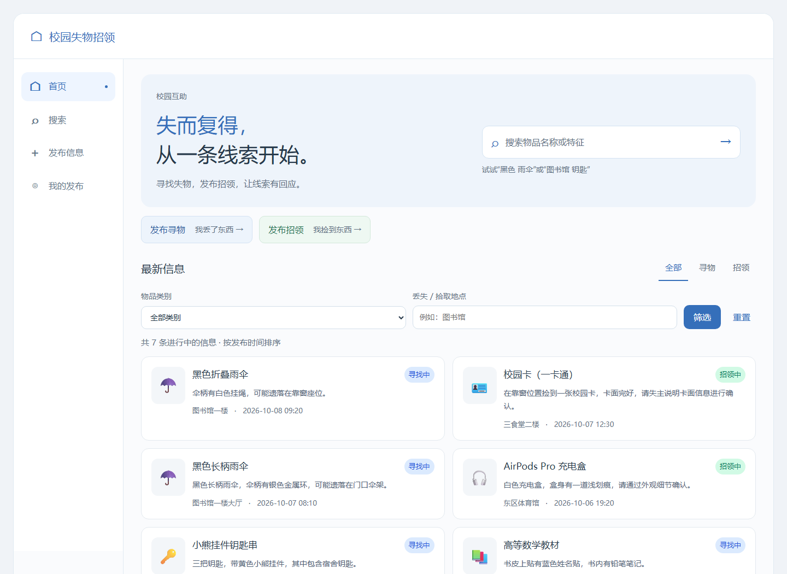

# 校园失物招领

面向校园场景的失物招领 Web 应用。学生可以集中发布寻物和招领信息，按关键词与条件查找物品，在详情页查看联系方式；发布者可以编辑信息、更新物品状态或删除自己的记录。

| 结对成员 | 学号 |
| --- | --- |
| 龚巍斌 | 102400412 |
| 郑瀚 | 102401111 |

## 功能

| 模块 | 说明 |
| --- | --- |
| 首页与搜索 | 浏览寻物、招领信息；按类型、类别、地点筛选，使用多个关键词搜索，可选择查看已结束信息 |
| 发布信息 | 发布寻物或招领信息，填写名称、地点、时间、联系方式等；必填项和无效输入有明确提示 |
| 信息详情 | 查看物品描述、时间、地点、状态与联系方式，支持复制联系账号 |
| 我的发布 | 按发布者身份查看自己的记录，编辑内容，标记“已找到”或“已归还”，确认后删除 |
| 发布结果 | 发布成功后查看新记录、进入我的发布、返回首页或继续发布 |

页面适配桌面与手机宽度。关键操作在提交失败时保留已填写内容，恢复后可以重试。



## 技术与数据

前端使用 HTML、CSS 和原生 JavaScript；共享服务使用 Node.js 内置 HTTP、文件系统与 Crypto 模块。项目没有第三方运行依赖，也不需要数据库。

- **共享服务模式**：浏览器调用同源 API，服务将信息保存到 `data/posts.json`。发布者身份由服务端签名 Cookie 识别；只有原发布者能编辑、结束或删除其记录。其他用户刷新或重新查询后可以看到最新信息。
- **本机 HTML 模式**：直接用 Chrome 打开 `index.html`，数据保存在当前浏览器的 `localStorage`。此模式适合单机体验，与共享服务的数据互不迁移。

两种模式共用信息校验与页面交互。共享服务在首次创建数据文件时预置八条校园物品示例；已有数据不会在启动时被覆盖。`data/` 包含记录和身份密钥，已加入 Git 忽略列表。

### 主要接口

| 方法与路径 | 用途 |
| --- | --- |
| `GET /api/posts`、`GET /api/posts/:id` | 浏览信息与查看详情 |
| `GET /api/my-posts` | 查看当前发布者的记录 |
| `POST /api/posts` | 发布信息 |
| `PUT /api/posts/:id` | 编辑本人发布的内容 |
| `PATCH /api/posts/:id` | 将本人记录标记为已找到或已归还 |
| `DELETE /api/posts/:id` | 删除本人记录 |

## 启动项目

建议使用 Node.js 24 和 Google Chrome。在项目根目录运行：

```powershell
node server.cjs
```

随后打开 <http://127.0.0.1:3000>。无需执行 `npm install`。停止服务时，在启动服务的终端按 `Ctrl+C`。

首次启动会自动建立 `data/`。用普通窗口与隐身窗口可以模拟两位发布者：一方发布后，另一方刷新或重新搜索即可看到信息。需要更改端口时，可在启动前设置 `CAMPUS_PORT`；默认只监听本机地址 `127.0.0.1`。

如只需体验单浏览器流程，也可以直接用 Chrome 打开根目录的 `index.html`。本机模式与共享模式各自保存数据，切换入口不会自动同步。

## 测试

在项目根目录运行完整测试：

```powershell
node --test
```

最近一次本地验证为 **136 项通过、0 失败、0 跳过**，覆盖数据校验、搜索、发布者权限、文件持久化、HTTP 接口以及 Chrome 页面流程。浏览器测试会使用独立配置和临时数据，不读取个人浏览器资料。GitHub Actions 在推送、Pull Request、手动触发和定时任务中运行单元与接口测试；浏览器流程在本地执行。

可分别运行典型单元测试和接口测试：

```powershell
node --test tests/examples.test.cjs
node --test tests/server.test.cjs
```

测试用例说明见 [测试说明](测试说明.md)。

## 项目结构

```text
index.html                  Web 入口
css/app.css                 页面样式与响应式布局
js/                        浏览、搜索、详情、发布、编辑和本人管理模块
server.cjs                  共享 API、身份校验与文件持久化
tests/                      单元、HTTP 和 Chrome 页面测试
.github/workflows/tests.yml  自动化测试工作流
resource/                   原型图、流程图和程序截图
data/                       运行时数据，不提交到 Git
```

## 使用限制

共享模式需要保持服务运行，目前采用单进程文件存储；其他用户需刷新或重新查询才能看到更新。发布者身份依赖浏览器 Cookie 与服务端密钥，清除 Cookie 或丢失密钥后无法继续管理原记录。本机模式的数据只保存在当前浏览器中。项目不包含账户登录、站内聊天、地图定位或图片上传。